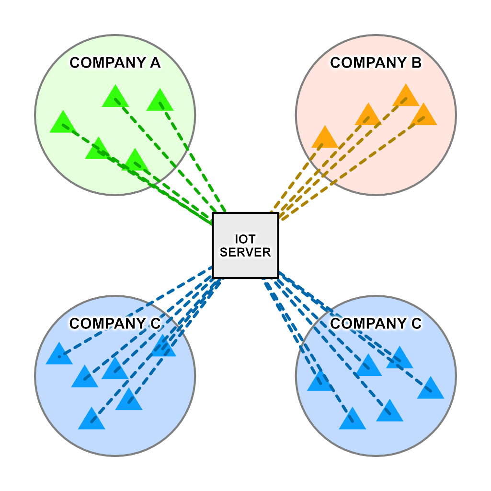
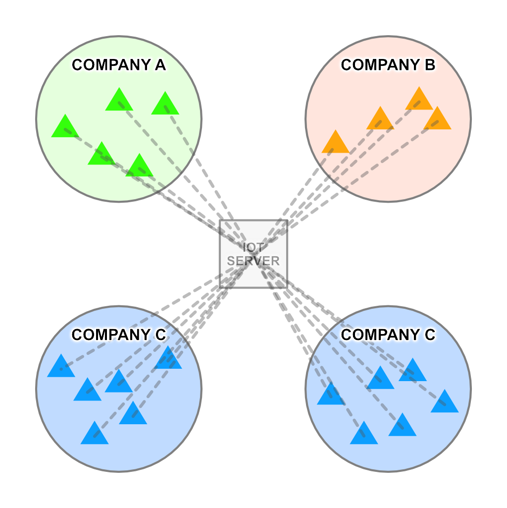
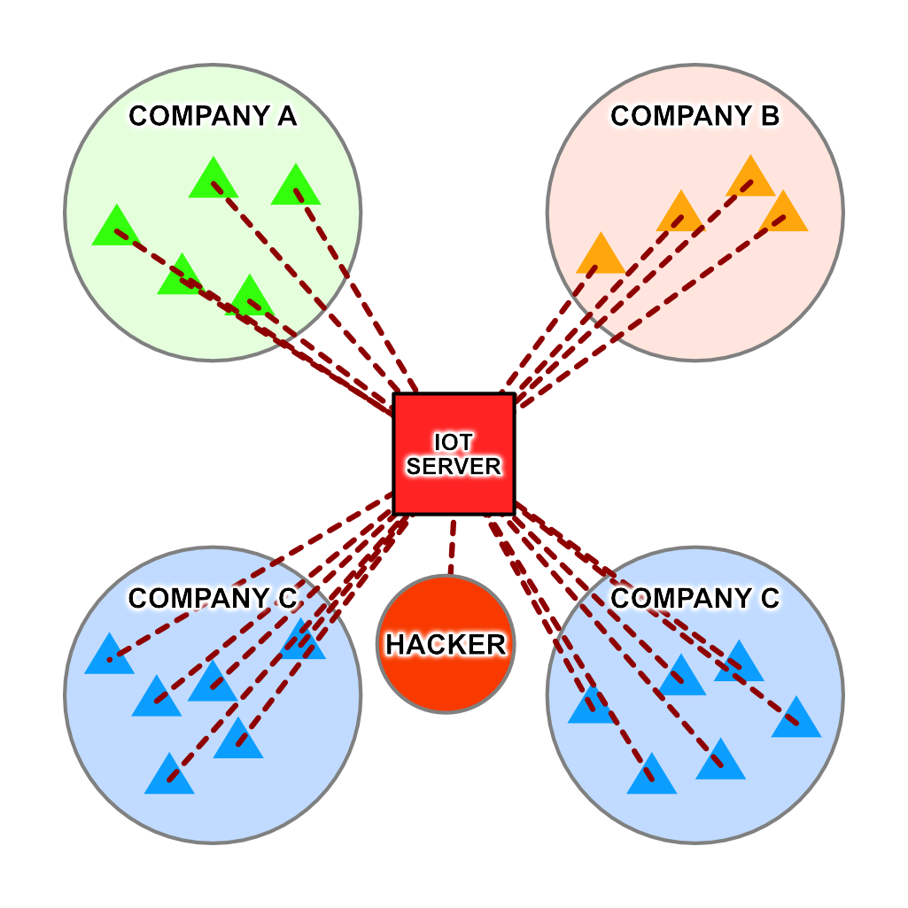
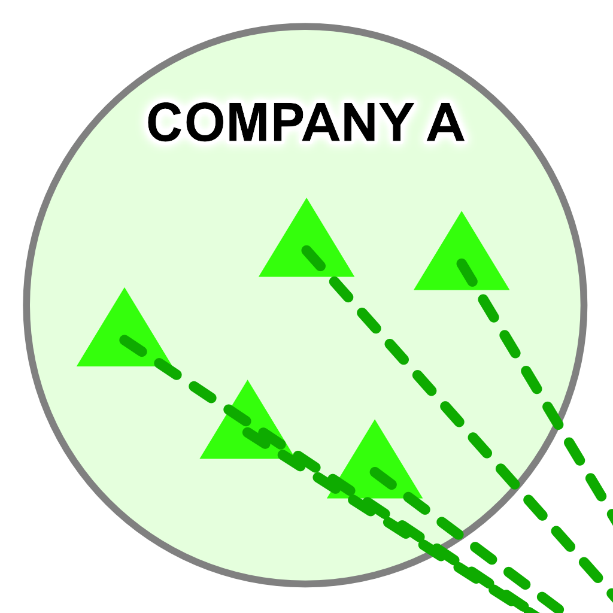
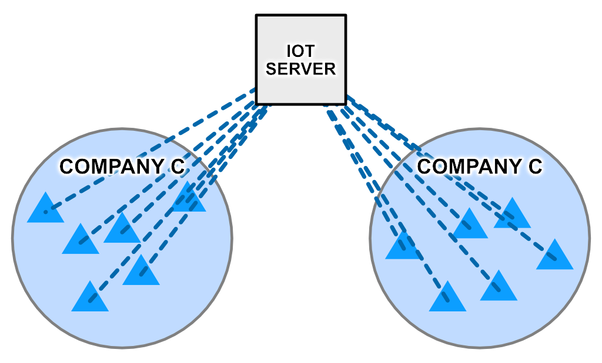
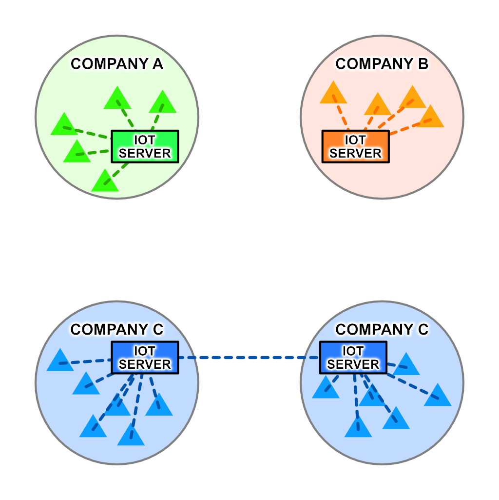
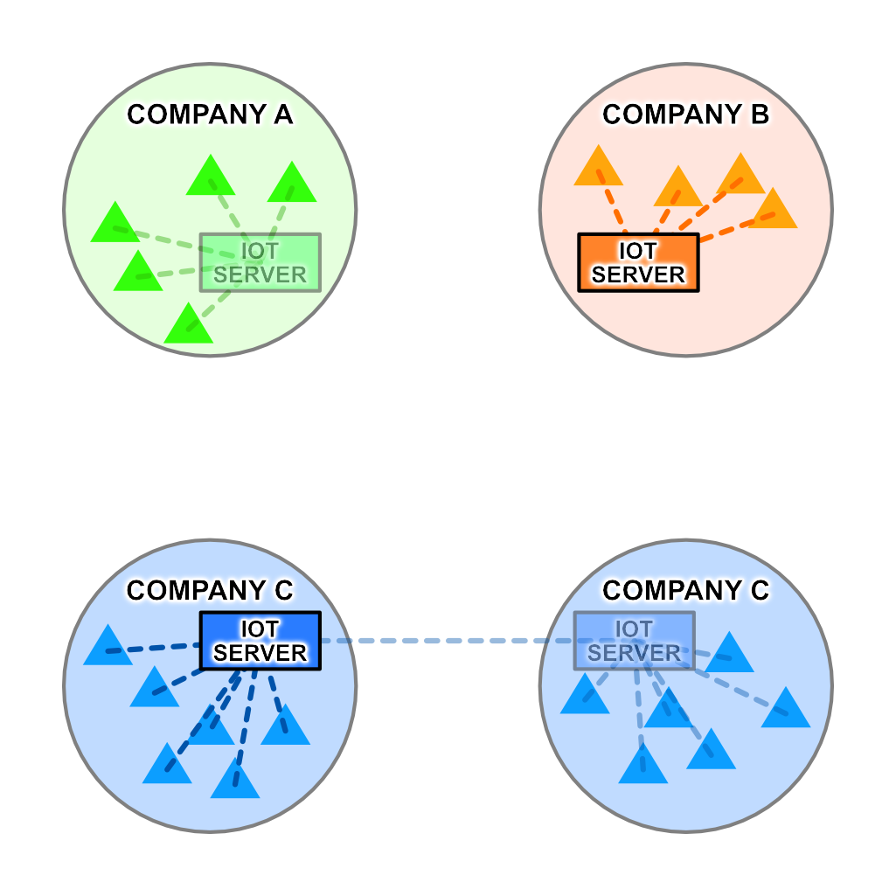
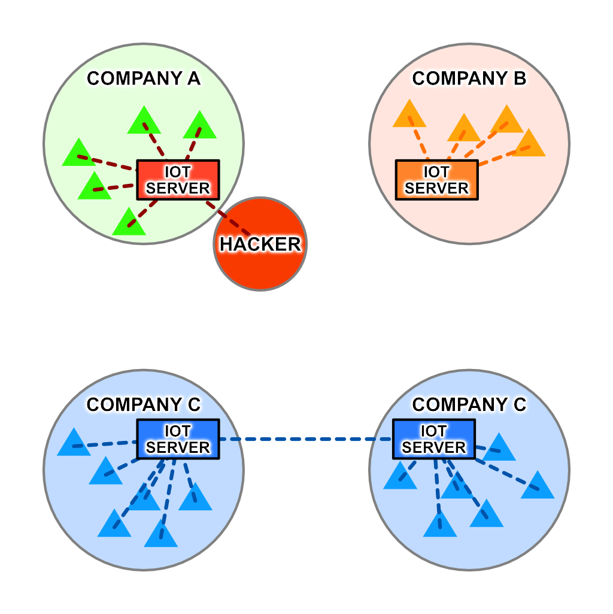
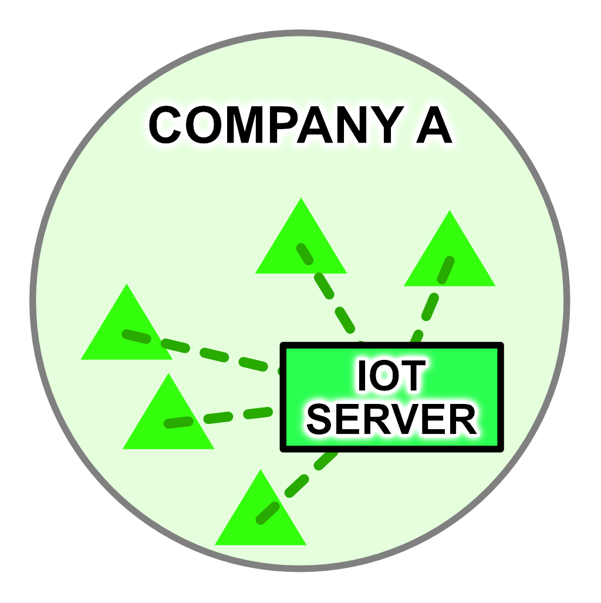
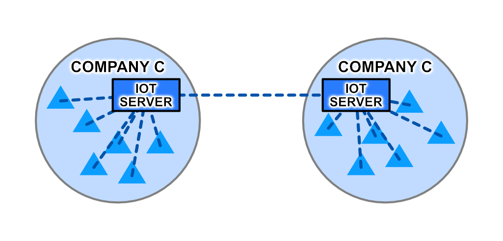

# README #

A brief overview of the advantages Linky's Intranets of Things provides over traditional Internet of Things approaches.

**Please note that Liot R is still heavily in development and as such not all features are available or stable. Application and prerequisite installation must be performed manually.** Documentation is far from complete as well.

# Table of Contents

<!-- START doctoc generated TOC please keep comment here to allow auto update -->
<!-- DON'T EDIT THIS SECTION, INSTEAD RE-RUN doctoc TO UPDATE -->


- [Internet of Things vs Intranets of Things](#internet-of-things-vs-intranets-of-things)
  - [The Problems with IoT](#the-problems-with-iot)
    - [Mass Outage](#mass-outage)
    - [Mass Breach](#mass-breach)
    - [Reduced Security](#reduced-security)
    - [Increased Bandwidth Usage](#increased-bandwidth-usage)
  - [The Solution](#the-solution)
    - [Outage Insulation](#outage-insulation)
    - [Hacking Insulation](#hacking-insulation)
    - [Maximum Security](#maximum-security)
    - [Reduced Bandwidth Usage](#reduced-bandwidth-usage)
  - [Introducing the Intranets of Things](#introducing-the-intranets-of-things)
- [Liot R: The IoT Router](#liot-r-the-iot-router)
  - [The Liot Architecture](#the-liot-architecture)
    - [Collectors](#collectors)
    - [Filters](#filters)
    - [Collators](#collators)
    - [Distributors](#distributors)
  - [Use Case 1: Temperature Monitoring](#use-case-1-temperature-monitoring)
  - [Use Case 2: Airgapped IoT Network](#use-case-2-airgapped-iot-network)
- [Project Development and Status](#project-development-and-status)

<!-- END doctoc generated TOC please keep comment here to allow auto update -->


# Internet of Things vs Intranets of Things

## The Problems with IoT ##

Traditional IoT configurations rely third-party servers to transfer data between devices. However, this introduces numerous weaknesses.



### Mass Outage
If the server goes down, all connected devices from all customer companies are disconnected and sent offline.




### Mass Breach
If the server is hacked, data from all parties is vulnerable to leaks and theft.



### Reduced Security

IoT devices existing on each company's internal network must maintain a connection to the Internet.



### Increased Bandwidth Usage
All data must pass through the central server, even if it is only going to be accessed by servers internal to your network. On a large scale, such as an IoT network spanning an entire city, this can prove prohibitively expensive.



## The Solution
One possible solution to these problems is to internalize IoT servers into each company's network. Normally, this would require complex combinations of hardware and software, with each company creating their own standards. Linky IoT is a client/server software package that not only ships with an easy-to-use, drag-and-drop network designer, but is compatible with every device capable of connecting to your company's intranet.



### Outage Insulation
If one or more IoT servers are downed, none of the other companies are affected. Even if one facility of one company goes down, its other facility can remain online.



### Hacking Insulation
If one server is hacked, no other servers are affected.



### Maximum Security
Linky IoT devices require no Internet connection, allowing your network to be fully air-gapped.



### Reduced Bandwidth Usage
Only data that needed at another facility needs to leave its facility of origin, reducing bandwidth requirements, latency, and risk of data leak.



## Introducing the Intranets of Things
Linky IoT stands not for Internet of Things, but _Intranets_ of Things. Many of the problems IoT faces are simply inherent to its nature and cannot be solved without changing the paradigm entirely. Your data is safest in your own hands, under your control, not that of some big corporation.
**Keep your data yours. Create an Intranet of Things.**

# Liot R: The IoT Router

The strength behind a successful Intranet of Things network is the ability to filter out unneeded data packets. By only egressing the packets that matter, the useless barrage of unnecessary packets can be entirely avoided. Liot R is a piece of software that functions as a logical router between IoT devices and their servers. Multiple Liot Routers can be chained together in hierarchies, meshes, circles, and any other topology. Although currently in development, Liot R is capable of running on Windows, Mac, and Linux, provided you don't mind a bit of manual configuration.

## The Liot Architecture

Liot operates on four types of virtual devices: Collectors, Filters, Collators, and Distributors.

### Collectors

Collectors are input devices that can receive data from any type of IoT sensor as long as it's in the JSON format. Each collector has an Accessor ID that must be included in the packet as a form of identification and authentication. If the collector represents another Liot Router, an Aggregate ID can be used to grant the router permission to forward data on behalf of other devices.

### Filters

When a collector receives data from its associated device, it is checked against any active filters. Filters can process packets based on any number of attributes present in the packet's JSON data, including device manufacturer, values reported, and many other properties; boolean logic can be used to filter based on multiple attributes simultaneously. If a filtered packet does not meet the criteria specified, it is discarded. If the packet meets the filter's requirements, it is passed on to any Collators attached to the filter.

### Collators

Collators combine data from multiple filters for easy aggregation of data. Need temperature data from these sensors, barometric data from some other sensors, and color data from yet more sensors? Instead of creating a new filter combining three distinct existing filters, Collators can be used to aggregate data from these filters without requiring complicated boolean logic.

### Distributors

Once data has been collected, filtered, and collated, it is ready for distribution. Each device that is to receive packets from a Liot Router must have its own distributor and Accessor ID to ensure proper dissemination of data.

Distributors come in two variants:

1. Asynchronous distributors temporarily store data for retrieval via request from an external device
  1. If there is a pending async request to a distributor, new packets will automatically be sent to it
  2. Queued distributors can be used to store large amounts of data for retrieval at a later date
1. Synchronous distributors send new packets to a specified callback URL.
  1. If the destination is another Liot Router, an Accessor ID can be included in the data forwarded.
  2. Callback URLs can be used to send data to other software on the same machine Liot R is running on by setting the URL to `http://localhost:xxxxx`

#Use Cases

## Use Case 1: Temperature Monitoring

In this scenario, there are ten facilities all connected to a central IoT server. Each of these ten facilities contains 1,000 thermometers, each of which reports the current temperature once per minute. The central server then determines if any temperatures are out of range (less than 32F or more than 105F); if one is, it reports the data to whichever facility contains the sensor.

This setup is problematic as each facility must send 1.4 million requests daily to the central server to continuously report the current temperatures, even though only reports containing temperatures out of an acceptable range are relevant.

Now let's install a Liot Router inside each of these facilities. These routers are programmed to collect data from the thermometers, determine which sensors are reporting data that is outside of the acceptable range, and only send these packets on to the central server. Now, instead of each facility sending 1.4 million packets per day to the central server, they are sending only the 50 packets that are actually out of range.

This temperature range filter is coded in a standard JSON format and looks like this:
```json
{
  "AND": {
    "OR": {
      "UNDER": [ "$value", 32 ],
      "OVER": [ "$value", 105 ]
    },
    "EQUALS": [ "$device_info.manufacturer", "AcuRite" ]
  }
}
```
This filter checks two aspects of each packet of IoT data:
1. That the value of the sensor is under 32 or over 105
2. That the manufacturer of the sensor is AcuRite

If these conditions are satisfied, the packet is passed on to the central server.

Let's take this a step further by installing a backup server in each of the facilities. These backup servers are to retain all packets received by their Liot Routers regardless of the temperature they are reporting. To accomplish this, a second filter must be created:
```json
{
  "EQUALS": [1, 1]
}
```
This filter is always satisfied and will pass any packets received on to the internal backup server. These packets, however, do not have to leave the internal network and therefore do not place a burden on the facility's egress bandwidth.

Diving further down the rabbit hole, we create a Queued Distributor on each of the Liot Routers and connect them to their respective backup filters. These QDs will retain any packets sent to them for retrieval at a later date. Let's return to our central facility and install a large backup storage center that will retain all data ever reported by each facilities' internal sensors. However, instead of receiving the IoT data packets as they are generated, a `cron` task is set to automatically once per day retrieve the data stored in each facility's QD. This data can now be transferred all at once and in a highly compressed format in order to minimize bandwidth consumption.

We now have a setup that:
1. Reduces bandwidth usage by filtering out irrelevant data packets
2. Backs up data locally in each facility
3. Compresses and transfers large amounts of data to the central server for backup

These filters and Queued Distributors can be created and modified via a JSON-based RESTful API, using the JavaScript library, or with the easy-to-use admin panel included with Liot R.

## Use Case 2: Airgapped IoT Network

In this scenario, there is a single facility containing 5,000 panic buttons. If one of these buttons is pressed, a signal is to be sent to the alarm system and trigger a floor-wide lockdown. Such an alarm system requires maximum security and thus must be isolated from the Internet entirely in order to prevent external hackers from gaining control of alarm system and wreaking havoc. Thus, traditional 3rd-party centralized IoT systems are not possible to use as many require a constant or at least intermittent Internet connection to operate.

Liot Router, however, can be run on an airgapped network without issue as no connection to an external server is required for operation or even initial setup. This network, pictured below, has a panic button in each room, a Liot Router on each floor, and a central router on the first floor.


Here's how the setup functions:
1. When a panic button is pressed, it sends a signal to the floor's Liot Router.
2. The Liot Router sends a signal to the security systems on that floor, triggering a lockdown.
3. The Liot Router also sends a signal to the central Liot Router, which logs the event but does not disseminate the lockdown notification to the other floors as only a floor-wide lockdown is necessary.
4. If the central router is deactivated or destroyed, the floor routers continue to function with only the facility-wide backup functionality disabled.
5. If a floor router is deactivated or destroyed, the remaining floor routers continue to function with no issue.

This decentralized setup allows not only for an entirely airgapped network, but for segments of the network to continue functioning even if other segments are disabled.

# Project Development and Status

Liot R is currently in development and is not yet fully functional. Installation and setup of certain prerequisites must be performed manually.

* Collectors
  * Features
    * [x] Web UI
    * [x] Simple collectors
    * [x] Aggregate collectors
  * Functions
    * [x] addCollectors
    - [x] deleteCollectors
    - [x] listCollectors
    - [x] getCollectors
* Filters
  * Features
    * [x] Web UI
  * Functions
    * [x] addFilters
    - [x] deleteFilters
    - [x] listFilters
    - [x] getFilters
    - [x] countReferences
    - [x] listReferrers
* Collators
  * Features
    * [x] Web UI
  * Functions
    * [x] addCollectors
    - [x] deleteCollectors
    - [x] listCollectors
    - [x] getCollectors
    - [x] countReferences
    - [ ] listReferrers
* Distributors
  * Features
    - [x] Web UI
    - [ ] Push updates
      - [ ] Queued updates
    - [x] Callback updates
      - [ ] Accessor overriding
  * Functions
    * [x] addCollectors
    - [x] deleteCollectors
    - [x] listCollectors
    - [x] getCollectors
- Updates
  - Features
    - [x] Simple update
    - [x] Aggregate update
  - Functions
    - [x] pushUpdate
    - [ ] pushUpdates
